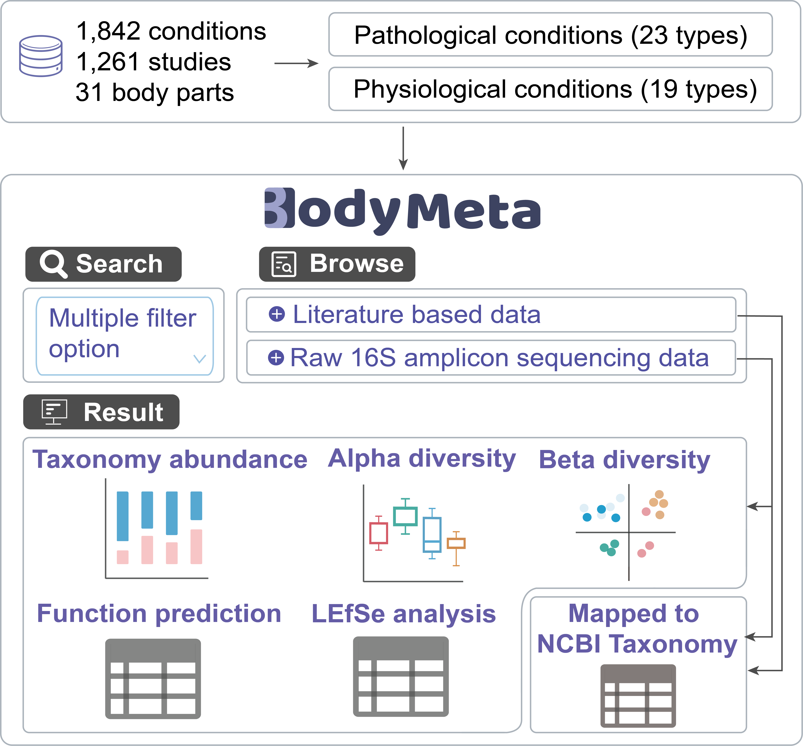

# BodyMeta: a Comprehensive Database for Microbes under Various Physiological and Pathological Conditions

**BodyMeta (Body Metagenome)** (https://bodymeta.omicsbio.info/) is a comprehensive database for microbes across body sites from human and mice. In total, 1,842 conditions derived from 1,261 studies across 31 body parts of human and mice, carefully categorized as 23 types of pathological changes and 19 types of physiological changes were collected and integrated in the database.

## 🔍 Database Overview

- A total of **59,010 microbes** were collected from literature sources and **40,657 microbes** from public 16S amplicon sequencing data.
- All microbial entries are **standardized to the NCBI Taxonomy database**.
- Functional annotations, diversity measures, biomarker identification, and taxonomy-level comparisons are performed on the raw 16S data.
- **Dual taxonomy mapping** is supported, enabling comparisons between **NCBI** and **GTDB** classification systems.

## 🔍  Key Features

- **Metadata Integration**: Harmonized metadata from both literature and raw sequencing sources.
- **16S Amplicon Data Processing**: Automated pipelines for diversity, biomarker, and functional analysis.
- **Taxonomy Mapping**: Unified NCBI annotation and cross-referencing with GTDB metadata.

